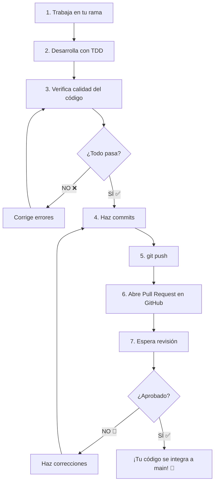

# Contribuyendo al Proyecto 🤝

Este documento te guiará paso a paso para contribuir tu trabajo al proyecto Bufalo.

---

## Reglas de TDD 🔄

Antes de empezar, recuerda siempre seguir el ciclo de TDD:

1. **🔴 Rojo**: Escribe una prueba que falle (porque el código aún no existe)
2. **🟢 Verde**: Escribe el código mínimo necesario para que la prueba pase
3. **🔵 Refactorizar**: Mejora el código manteniendo las pruebas pasando

---

## Proceso de Contribución 📝

### Paso 1: Trabaja en tu rama personal

Cada estudiante tiene su propia rama en el repositorio. El nombre de tu rama debe ser tu nombre o identificador único.

**Verifica que estás en tu rama:**
```powershell
git branch
```

Debes ver un asterisco (*) junto al nombre de tu rama. Si no estás en tu rama, cámbiate a ella:
```powershell
git switch nombre-de-tu-rama
```

### Paso 2: Desarrolla tu módulo

1. Crea tu archivo de pruebas en `tests/test_tu_modulo.py`
2. Escribe las pruebas siguiendo TDD
3. Crea tu módulo en `src/bufalo/modulos/tu_modulo.py`
4. Implementa el código para que las pruebas pasen

### Paso 3: Verifica la calidad de tu código ✅

Antes de hacer commit, **todas** estas verificaciones deben pasar:

- **Las pruebas deben pasar**: `uv run pytest`
- **El código debe estar bien formateado**: `uv run ruff format .`
- **El código debe pasar el linter**: `uv run ruff check .`
- **Los tipos deben ser correctos**: `uv run ty .`

Si alguna falla, corrígela antes de continuar.

### Paso 4: Guarda tus cambios con commits 💾

Un **commit** es como una fotografía de tu código en un momento específico. Es importante hacer commits frecuentes con mensajes claros.

#### Revisar qué archivos cambiaste:
```powershell
git status
```

Verás una lista de archivos modificados en rojo.

#### Agregar archivos al commit:
```powershell
# Agregar un archivo específico
git add tests/test_tu_modulo.py

# O agregar todos los archivos modificados
git add .
```

#### Crear el commit con un mensaje descriptivo:
```powershell
git commit -m "Agrega módulo de calculadora con operaciones básicas"
```

**Consejos para buenos mensajes de commit:**
- Usa verbos en presente: "Agrega", "Corrige", "Actualiza"
- Sé específico: "Agrega pruebas para división por cero"
- Mantén el mensaje corto pero descriptivo

#### Ejemplo de múltiples commits:
```powershell
# Primer commit: las pruebas
git add tests/test_calculadora.py
git commit -m "Agrega pruebas para módulo calculadora"

# Segundo commit: el código
git add src/bufalo/modulos/calculadora.py
git commit -m "Implementa operaciones de calculadora"

# Tercer commit: documentación
git add tests/test_calculadora.py
git commit -m "Documenta pruebas de calculadora"
```

### Paso 5: Sube tus cambios a GitHub 🚀

Ahora que tus cambios están guardados localmente, necesitas subirlos a GitHub para que otros puedan verlos.

```powershell
git push origin nombre-de-tu-rama
```

Si es la primera vez que subes esta rama, Git te pedirá configurar el upstream:
```powershell
git push --set-upstream origin nombre-de-tu-rama
```

⏳ Espera unos segundos mientras Git sube tus cambios a GitHub.

### Paso 6: Abre un Pull Request (PR) 📬

Un **Pull Request** es una solicitud para integrar tus cambios a la rama principal del proyecto.

#### En GitHub:

1. **Ve al repositorio en GitHub**
   - Abre tu navegador y ve a la página del proyecto en GitHub

2. **Verás un banner amarillo** que dice algo como:
   - "nombre-de-tu-rama had recent pushes"
   - Haz clic en el botón **"Compare & pull request"**

3. **Completa la información del Pull Request:**
   - **Título**: Describe brevemente tu contribución
     - Ejemplo: "Agrega módulo calculadora"
   - **Descripción**: Explica qué hiciste y por qué
     - Ejemplo:
       ```
       ## Cambios
       - Implementé el módulo calculadora con 4 operaciones básicas
       - Agregué 14 pruebas que cubren todos los casos
       - Documenté las pruebas en español
       
       ## Verificaciones
       - ✅ Todas las pruebas pasan
       - ✅ Cobertura de código: 100%
       - ✅ Ruff: sin errores
       - ✅ Ty: sin errores
       ```

4. **Haz clic en "Create pull request"** 🎉

### Paso 7: Espera la revisión 👀

Tu instructor o compañeros revisarán tu código. Pueden:
- ✅ **Aprobar** el PR si todo está bien
- 💬 **Comentar** si tienen sugerencias
- ❌ **Solicitar cambios** si hay algo que corregir

Si te piden cambios:
1. Haz las correcciones en tu rama local
2. Crea un nuevo commit con los cambios
3. Sube los cambios con `git push`
4. El Pull Request se actualizará automáticamente

---

## Requisitos para que tu Pull Request sea aceptado ✅

Tu PR debe cumplir con **todos** estos requisitos:

- ✅ **100% Cobertura de Pruebas**: Todas las líneas de código de tu módulo deben estar probadas
- ✅ **Todas las pruebas pasando**: `uv run pytest` debe mostrar todo en verde
- ✅ **Ruff pasando**: `uv run ruff check .` sin errores
- ✅ **Ty pasando**: `uv run ty .` sin errores
- ✅ **Código documentado**: Docstrings y comentarios en español
- ✅ **Commits con mensajes claros**: Mensajes descriptivos en español

---

## Comandos de Git útiles 🛠️

### Ver el estado de tus archivos:
```powershell
git status
```

### Ver el historial de commits:
```powershell
git log --oneline
```

### Ver qué cambios hiciste en un archivo:
```powershell
git diff nombre-archivo.py
```

### Deshacer cambios no guardados:
```powershell
# Deshacer cambios en un archivo específico
git restore nombre-archivo.py

# Deshacer todos los cambios no guardados
git restore .
```

### Actualizar tu rama con los últimos cambios de main:
```powershell
git pull origin main
```

Esto traerá los últimos cambios de la rama principal y los fusionará con tu rama actual.

---

## Resumen del flujo completo 📋



---

## Consejos finales 💡

1. **Haz commits frecuentes**: No esperes a terminar todo para hacer commit
2. **Mensajes claros**: Tus compañeros deben entender qué hiciste sin ver el código
3. **Prueba antes de subir**: Siempre ejecuta las verificaciones de calidad antes de push
4. **Pide ayuda**: Si algo no funciona, pregunta a tu instructor o compañeros
5. **Revisa el código de otros**: Aprender de los PRs de tus compañeros es muy valioso

¡Buena suerte con tu contribución! 🚀

---

## 📖 Navegación

> [!NOTE]
> **¡Felicidades!** Has completado todas las guías. Ahora estás listo para contribuir al proyecto.

- 🏠 [Volver al README](../README.md)
- ⬅️ **Anterior**: [Aseguramiento de Calidad](Calidad.md)
- 🔄 **Revisar**: [TDD y pytest](Pytest.md) | [Instalación de UV](Uv.md)

