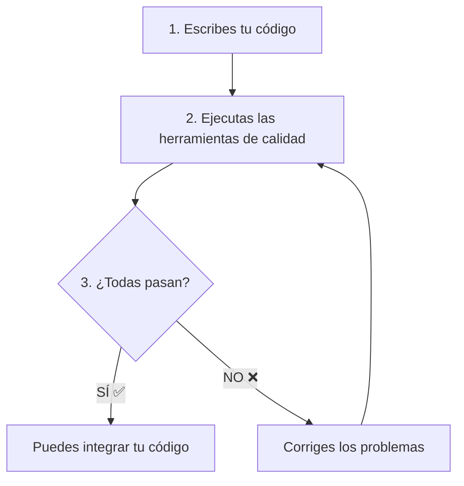

# Herramientas de Aseguramiento de Calidad 🛡️

En ingeniería de software, no basta con que el código funcione. También debe ser **legible**, **correcto** y **bien probado**. Para esto usamos herramientas de aseguramiento de calidad.

En este proyecto usamos tres herramientas principales:

---

## 1. Ruff 🧹

### ¿Qué es?
**Ruff** es un **linter** y **formateador** de código Python.

### ¿A qué parte de la ingeniería de software pertenece?
**Análisis estático de código** - revisa el código sin ejecutarlo.

### ¿Por qué es importante?
- Mantiene el código **consistente** y **legible**
- Detecta errores comunes antes de ejecutar el programa
- Asegura que todo el equipo siga las mismas reglas de estilo

### ¿Qué problemas resuelve?
- ❌ Variables que nunca se usan
- ❌ Imports desordenados o innecesarios
- ❌ Líneas de código muy largas
- ❌ Espacios en blanco inconsistentes
- ❌ Errores de sintaxis obvios

### Cómo usarlo:
```powershell
# Revisar el código
uv run ruff check .

# Formatear el código automáticamente
uv run ruff format .
```

---

## 2. Ty (mypy) 🔍

### ¿Qué es?
**Ty** (también conocido como **mypy**) es un **verificador de tipos** para Python.

### ¿A qué parte de la ingeniería de software pertenece?
**Verificación de tipos estática** - asegura que los tipos de datos sean correctos.

### ¿Por qué es importante?
- Detecta errores de tipo **antes** de ejecutar el código
- Hace el código más **predecible** y **fácil de entender**
- Previene bugs comunes relacionados con tipos de datos

### ¿Qué problemas resuelve?
- ❌ Pasar un número donde se espera texto
- ❌ Llamar funciones con argumentos incorrectos
- ❌ Usar variables que podrían ser `None`
- ❌ Retornar tipos de datos incorrectos

### Cómo usarlo:
```powershell
uv run ty .
```

---

## 3. pytest-cov 📊

### ¿Qué es?
**pytest-cov** es una herramienta que mide la **cobertura de código** de nuestras pruebas.

### ¿A qué parte de la ingeniería de software pertenece?
**Métricas de calidad de pruebas** - mide qué tanto del código está probado.

### ¿Por qué es importante?
- Nos dice qué partes del código **NO** tienen pruebas
- Asegura que nuestras pruebas cubren casos importantes
- Aumenta la confianza en que el código funciona correctamente

### ¿Qué problemas resuelve?
- ❌ Código sin probar que podría tener bugs
- ❌ Funciones olvidadas en las pruebas
- ❌ Casos especiales no cubiertos
- ❌ Falsa sensación de seguridad con pocas pruebas

### Cómo usarlo:
```powershell
# Ver cobertura en la terminal
uv run pytest --cov

# Ver reporte detallado
uv run pytest --cov --cov-report=term-missing
```

---

## El proceso de integración 🔄

Cuando trabajas en equipo, no puedes simplemente agregar tu código al proyecto principal sin verificar que cumple con los estándares de calidad. Aquí es donde estas herramientas toman un papel crucial.

### Flujo de trabajo típico:



### Verificación antes de integrar:

Antes de que tu código pueda unirse a la rama principal (`main`), **todas** estas herramientas deben dar su visto bueno:

#### ✅ Checklist de calidad:

- **Las pruebas deben pasar**: `uv run pytest`
  - ✅ Resultado esperado: All tests passed

- **El código debe estar bien formateado**: `uv run ruff format .`
  - ✅ Resultado esperado: No changes needed

- **El código debe pasar el linter**: `uv run ruff check .`
  - ✅ Resultado esperado: All checks passed

- **Los tipos deben ser correctos**: `uv run ty .`
  - ✅ Resultado esperado: Success: no issues found

### ¿Por qué este proceso es importante?

1. **Calidad consistente**: Todo el código en el proyecto sigue los mismos estándares
2. **Menos bugs**: Los problemas se detectan antes de llegar a producción
3. **Trabajo en equipo**: Todos pueden leer y entender el código de los demás
4. **Confianza**: Sabemos que el código funciona y está bien escrito

### Analogía 🏗️

Piensa en construir una casa:
- **pytest**: Verifica que las puertas abren y las luces funcionan
- **ruff**: Asegura que todo esté ordenado y pintado correctamente
- **ty**: Confirma que usaste los materiales correctos (madera donde va madera, metal donde va metal)
- **pytest-cov**: Verifica que revisaste todas las habitaciones

Solo cuando **todas** estas verificaciones pasan, la casa está lista para habitarse (el código está listo para integrarse).

---

## Comando rápido para verificar todo 🚀

Puedes ejecutar todas las verificaciones con estos comandos en secuencia:

```powershell
# Formatear código
uv run ruff format .

# Verificar estilo
uv run ruff check .

# Verificar tipos
uv run ty .

# Ejecutar pruebas con cobertura
uv run pytest --cov
```

Si **todos** estos comandos terminan exitosamente, tu código está listo para integrarse al proyecto principal. 🎉

---

## Resumen 📋

| Herramienta | Qué verifica | Comando |
|-------------|--------------|---------|
| **Ruff** | Estilo y formato del código | `uv run ruff check .` |
| **Ty** | Tipos de datos correctos | `uv run ty .` |
| **pytest-cov** | Cobertura de pruebas | `uv run pytest --cov` |

**Regla de oro**: Antes de integrar tu código, todas estas herramientas deben dar luz verde ✅

---

## 📖 Navegación

> [!TIP]
> **Siguiente paso**: Aprende cómo contribuir tu código al proyecto con Git y Pull Requests.

- 🏠 [Volver al README](../README.md)
- ⬅️ **Anterior**: [TDD y pytest](Pytest.md)
- ➡️ **Siguiente**: [Contribuyendo al Proyecto](Branch.md)

